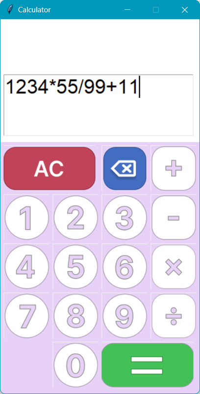

# Tkinter Calculator
This project is a simple calculator built using Python's Tkinter library. The calculator features a graphical user interface (GUI) with buttons for digits, basic arithmetic operations, and additional functionalities such as clearing the screen and deleting the last entry.

## Features
- Basic Operations: Perform addition, subtraction, multiplication, and division.
- Clear and Delete: Clear the entire calculation or delete the last entered digit/operator.
- Error Handling: Displays an error message if an invalid operation is performed.
- Graphical Interface: User-friendly interface with clickable buttons for each digit and operation.

## Screenshot


## Requirements
- Python 3.x
- Tkinter library

## Installation and Setup
1. Clone the Repository:
```bash
git clone https://github.com/Govind-Sankar/Python-Calculator.git
cd /Python-Calculator/
```
2. Install Requirements: This project requires Python 3.x and the Tkinter library (which is included with most Python installations).

3. Run the Application:
```bash
python Calculator.py
```

## Notes
- This calculator is designed for basic arithmetic calculations and does not support more advanced operations like exponentiation or square roots.
-  The calculator's interface is fixed in size (325x610 pixels) and cannot be resized.

## License
This project is open source and available under the [MIT License](https://opensource.org/licenses/MIT).